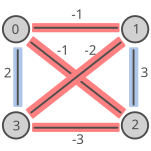
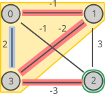
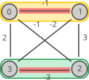

<!--
SPDX-FileCopyrightText: 2026 Andreia P. Guerreiro <andreia.guerreiro@tecnico.ulisboa.pt>
SPDX-FileCopyrightText: 2026 Carlos M. Fonseca <cmfonsec@dei.uc.pt>

SPDX-License-Identifier: CC-BY-4.0
-->

# Clique-Partitioning Problem

Andreia P. Guerreiro, INESC-ID, Lisbon, Portugal  
Carlos M. Fonseca, University of Coimbra, CISUC/LASI, DEI, Portugal

Copyright 2026 Andreia P. Guerreiro and Carlos M. Fonseca.

This document is licensed under CC-BY-4.0.

## Introduction

The clique-partitioning problem [1] is a well-known NP-hard
combinatorial optimisation problem, and many real-world problems can
be formulated as such. This problem is represented by a
fully-connected undirected weighted graph, where the edge weights may
take any value, including negative ones.

## Task

The goal is to partition the graph vertices into subsets in such a way
that minimises the total weight of the edges within the subsets. In
this case, these subsets are also called cliques. A *clique* is
defined as a fully-connected (sub)graph and, therefore, any subset of
vertices of this problem is a clique.

## Detailed description

Let $G:=(V,E)$ denote a graph with $n$ vertices $V := \lbrace
1,\ldots,n\rbrace$, and edges $E:=\lbrace(v_1,v_2) \ |\ v_1,v_2\in V,
v_1 \neq v_2\rbrace$, and let $W\in\mathbb{R}^{n\times n}$ be a weight
matrix where $w_{ij}$ denotes the weight associated to edge $(i,j)$,
for all $i,j\in\lbrace 1,\ldots,n\rbrace$. Note that, in this case,
$w_{ii}=0$ holds for all $i\in\lbrace 1,\ldots,n\rbrace$, and $W$ is a
symmetric matrix, i.e., $w_{ij}=w_{ji}$ always holds.

The goal is to find a partitioning of the vertices that minimises the
sum of the weights of the edges within each clique.

*Note*: Let ${P:=\lbrace C^{(1)}, \ldots, C^{(|P|)} \rbrace\subseteq
2^V}$ denote a set of $|P|$ cliques. The set $P$ is called a
*partitioning* of $V$ if, and only if

$$
\bigcup_\limits{k=1}^{|P|} C^{(k)} = V
$$

and ${C^{(k)} \cap C^{(\ell)} = \lbrace\rbrace}$ for all
$k,\ell\in\lbrace 1,\ldots,|P|\rbrace$ such that $k\neq \ell$. In
such a case, the value of the partitioning $P$ is

$$
{\sum^{|P|}_\limits{k=1} \sum_\limits{i,j \in C^{(k)} \\ i < j} w_{ij}}
$$

## Instance data file

The input file contains the number of vertices in graph $G$ followed
by the upper triangle of the weight matrix, $W$, that is:

- The first line contains a value, $n$;
- Then, $n$ lines follow. The $i$-th line contains weights
  $w_{ii},\ldots,w_{in}$

### Problem instances

Problem instances are available from
[here](https://github.com/hellozhilu/MDMCP) [2] and
[here](https://github.com/MMSorensen/CP-Lib) [3]. Note that, in these
sources the clique partitioning problem is formulated as a
maximisation problem. Nevertheless, the problems instances can be
easily converted for minimisation by taking the negative values of all
weights.

Note that the data files format in the two repositories differ
sightly. While the former is as described above, i.e., the lines with
the weights always begin with $w_{ii}$, which is zero, the latter
omits $w_{ii}$ from each of those lines, i.e., after the first line,
the $i$-th line contains weights $w_{ii+1},\ldots,w_{in}$.

## Solution file

The solution file should contain as many lines as cliques in the
partitioning of $V$. Each line represents one clique and contains the
indices of the vertices in that clique, separated by white spaces. The
order in which cliques and vertex indices (within each clique) are
printed is irrelevant.

*Note:* Consider that the vertex indices start at 0 instead of 1.

## Example

Consider the following example with $n=4$ vertices:

 

The corresponding weight matrix is given by:

$$
\begin{bmatrix}
  {0} &  {-1} & {-1} &  {2} \\
  -1  &  {0} &  {3} & {-2} \\
  -1  &  3 &  {0} &  {-3} \\
  2 & -2 &  -3 &  {0}
\end{bmatrix}
$$

### Instance

The input file for the above example is:

```
4
0 -1 -1 2
0 3 -2
0 -3
0
```

### Solution 1

A feasible solution is:

```
0 1 3
2
```

And the corresponding objective value is `-1`.

#### Explanation for solution 1

The following figure illustrates the solution. Each shaded region
(yellow and green) enclose the vertices and edges within a clique.

 

This solution partitions the set of vertices in two cliques, one with
vertices $0$, $1$, and $3$ (yellow region), and another with vertex
$2$ alone (green region). The former clique has a value of $-1$ has a
result of the sum $w_{01}+w_{03}+w_{13}=-1+2-2$. The latter clique
only has one vertex, and therefore, no edges which leads to a value of
$0$. Consequently, the objective value of the partitioning is $-1$.

### Solution 2

An optimal solution is:

```
0 1
2 3
```

And the corresponding objective value is `-4`.

#### Explanation for solution 2

The following figure illustrates the solution.

 

This solution partitions the set of vertices in two cliques, one with
vertices $0$ and $1$ (yellow region), and another with vertices $2$
and $3$ (green region). The former clique has a value of $-1$ which is
the weight of the sole edge in this clique ($w_{01}=-1$). The latter
clique has a value of $-3$ which is the weight of the sole edge in
this clique ($w_{23}=-3$). Consequently, the objective value of the
partitioning is $-4$.


## Acknowledgements

This problem statement is based upon work from COST Action Randomised
Optimisation Algorithms Research Network (ROAR-NET), CA22137, is supported by
COST (European Cooperation in Science and Technology).

<!-- Please keep the above acknowledgement. Add any other acknowledgements as
relevant. -->

Andreia P. Guerreiro acknowledges the financial support from FCT
through 2022.08367.CEECIND/CP1717/CT0001.

## References

[1] M. Grötschel and Y. Wakabayashi. "A cutting plane algorithm for a
clustering problem," *Mathematical Programming* 45.1 (1989): 59-96.

[2] Z. Lu, Y. Zhou and J. -K. Hao, "A Hybrid Evolutionary Algorithm
for the Clique Partitioning Problem," in *IEEE Transactions on
Cybernetics*, vol. 52, no. 9, pp. 9391-9403, Sept. 2022.

[3] M.M. Sørensen and A.N. Letchford. "CP-Lib: Benchmark Instances of
the Clique Partitioning Problem," *Math. Prog. Comp.* 16, 93–111
(2024). https://doi.org/10.1007/s12532-023-00249-1
