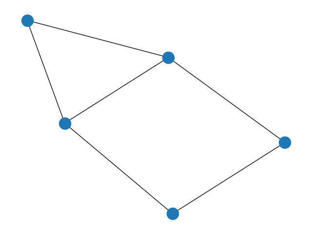
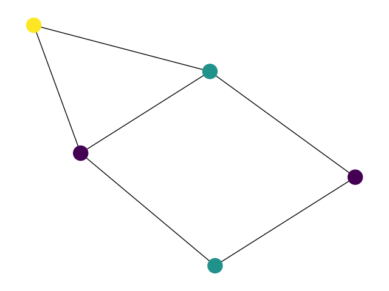

<!--
SPDX-FileCopyrightText: 2024 Alexandre Jesus <me@adbjesus.com>

SPDX-License-Identifier: CC-BY-4.0
-->

<!-- Replace the comment above with your licence information for your problem
statement. Consider all copyright holders and contributors. -->

<!-- According to the copyright and licensing policy of ROAR-NET original
problem statements contributed to this repository shall be licensed under the
CC-BY-4.0 licence. In some cases CC-BY-SA-4.0 might be accepted, e.g., if the
problem is based upon an existing problem licensed under those terms. Please
provide a clear justification when opening the pull request if the problem is
not licensed under CC-BY-4.0 -->

<!-- Remove the section below before submitting -->

# Graph Coloring (vertex coloring)

**Ondřej Liška¹, Patrik Olszar², David Sedlák²**\
¹ Brno University of Technology, Faculty of Mechanical Engineering, Czech Republic
² Brno University of Technology, Faculty of Information Technology, Czech Republic

Copyright 2025 Ondřej Liška, Patrik Olszar, David Sedlák

This document is licensed under CC-BY-4.0.

## Introduction

The Graph Coloring problem is a classic challenge in graph theory and combinatorial optimisation.
Its objective is to assign colors to the vertices of an undirected graph such that no two adjacent vertices share the same color, and the total number of used colors is minimized.

This problem arises in a variety of real-world scenarios, such as scheduling, register allocation in compilers, and frequency assignment in wireless networks. Due to its NP-hard nature, it is also widely used as a benchmark for exact and heuristic optimisation methods.

## Task

Assign a color (represented as an integer) to each vertex of a given undirected graph such that adjacent vertices receive different colors and the number of distinct colors used is minimised.

## Detailed Description

Each problem instance defines an **undirected graph** `G = (V, E)`, where:

- `V` is the set of **vertices**, typically numbered from `0` to `n - 1`
- `E` is the set of **edges**, where each edge is an unordered pair `{u, v}`

---

### Objective

The goal is to find a **coloring function**:

    c: V → ℕ

such that:

- For every edge `{u, v} ∈ E`, the colors are different:

  c(u) ≠ c(v)

- The total number of colors used is minimised:

  min( max\_{v ∈ V} c(v) + 1 )

---

### Infeasible Solutions

A solution is **infeasible** if **any** adjacent vertices are assigned the **same color**, i.e.

    ∃ {u,v} ∈ E: c(u) = c(v)

---

### Valid Solution

A solution is **valid** if all adjacency constraints are satisfied, and the number of colors is minimised.

## Instance data file

The input format is based on the standard [DIMACS `.col` format] - more instances can be found there: (<https://github.com/dynaroars/npbench/tree/master/instances/coloring/graph_color>)

- Lines starting with `c` are comments
- The `p` line has the form: `p edge <number_of_vertices> <number_of_edges>`
- Each edge is defined on a line: `e <u> <v>` (1-based vertex indices)

> In the `support` folder, you can find a method that transforms the input from this format into a matrix.

## Solution file

The solution must be provided as a plain text file, where each line assigns a color to a vertex.

Each line has the format:

`<vertex_id> <color_id>`

For example:

```
0 0
1 1
2 0
3 1
```

- `vertex_id` is an integer matching the ID of a vertex in the input graph.
- `color_id` is a non-negative integer representing the assigned color.
- Vertex indices must match those used in the input instance file.
- The format assumes one-based or zero-based indexing, depending on the instance.

This format will be used by the solution validator included in the `support/` folder.

## Example

### Instance

A simple graph with 5 vertices and 6 edges, in edge list format:

```
0 1
0 2
1 2
1 3
2 4
3 4
```

Visual representation of the graph:



### Solution

A feasible 3-coloring of the graph:

```
0 0
1 1
2 0
3 2
4 1
```

This uses 3 colors:
-Color 0 (e.g. red) for vertices 0 and 2
-Color 1 (e.g. green) for vertices 1 and 4
-Color 2 (e.g. blue) for vertex 3

### Explanation

The following image shows a valid coloring of the graph where no adjacent vertices share the same color.
This solution uses 3 distinct colors.



## Acknowledgements

This problem statement is based upon work from COST Action Randomised
Optimisation Algorithms Research Network (ROAR-NET), CA22137, is supported by
COST (European Cooperation in Science and Technology).

<!-- Please keep the above acknowledgement. Add any other acknowledgements as
relevant. -->

## References

- Garey, M. R., & Johnson, D. S. (1979). _Computers and Intractability: A Guide to the Theory of NP-Completeness_. W. H. Freeman.
- Jensen, T. R., & Toft, B. (1995). _Graph Coloring Problems_. Wiley-Interscience.
