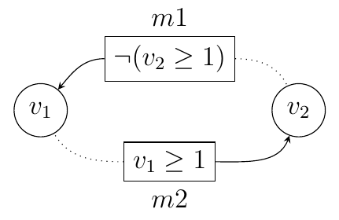
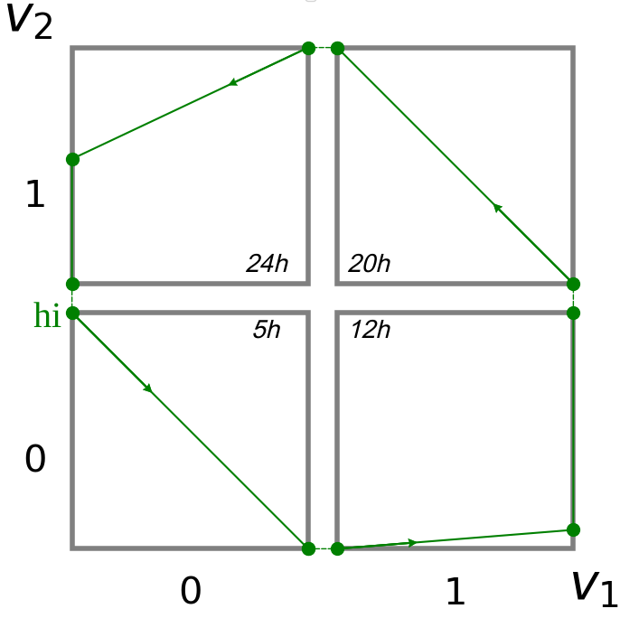

SPDX-FileCopyrightText: 2024 Denis PALLEZ <denis.pallez@univ-cotedazur.fr>

SPDX-License-Identifier: CC-BY-4.0


# hybrid Gene Regulatory Network modelling

Romain MICHELUCCI, Université Côte d'Azur, France  


Denis PALLEZ, Université Côte d'Azur, France  


Jean-Paul COMET, Université Côte d'Azur, France  


Copyright 2024 ... place copyright holders here.

This document is licensed under XXXX.

<!-- Complete the above accordingly. Copyright and licensing information must be
consistent with the comment at the beggining of the markdown file -->

## Introduction

Modelling Gene Regulatory Networks (GRN) allows the study of the dynamic of biological systems, taking into account both the structural relationship between genes and the continuous time evolution of gene concentrations.
It provides a new and better understanding of the onset and progression of disease, opening up new perspectives in pharmacological fields such as chronotherapy, which makes it possible to identify the best time of day to administer a drug in order to limit side effects while maintaining therapeutic efficacy.
Numerous frameworks have been proposed for representing GRN (differential, stochastic or discrete) and many techniques have been proposed for finding parameters of such models [[Spirov2013](https://doi.org/10.1016/j.ymeth.2013.05.013)].
In the present document, we prefer to consider hybrid frameworks, called hGRN, which add to discrete modelling the time spent in each of the discrete states, represented by celerities (one celerity vector for each discrete state).
Traditionally, a GRN is a directed graph $G(V,E)$ in which vertices express abstractions of one or multiple biological genes, and edges express either the activation ($+k$) or the inhibition ($-k$) of one vertex by another only if the concentration of the source vertex is above its $k^{th}$ threshold.
Contrary to many works that try to automatically build a model from raw experimental data [[daSilva2020](https://doi.org/10.1109/CEC48606.2020.9185572)], the interest of the present problem is to take into account already formalised information, analysed by biologists themselves, coming from both biological data and expertise, expressed as constraints on the celerities [[Michelucci2022](https://doi.org/10.1007/978-3-031-42616-2_12)].
An attempt has been made to use a continuous Constraint Satisfaction Problem (CSP) solver to extract parameters values of hGRN considering constraints but faced difficulties when the number of parameters increased [[Behaegel2018](https://www.doi.org/10.1109/ICTAI.2018.00028)], especially when number of genes exceeds 5.
The key idea is to transform the Constraint Satisfaction Problem into a Free Optimization Problem where the fitness function expresses how a set of celerities violates the constraints.

## Task

From the interaction graph $G(V,E)$, the goal is to characterise the hGRN dynamics by identifying the celerities in each discrete state that are consistent with the biological knowledge expressed as constraints, knowing that a celerity is a g-dimensional floating vector, where g is the number of genes in $G$ ($g = |V|$).
Morevover, the set of constraints may often be insufficient to characterise only one sequence of celerities (called _global trajectory_), the result of the optimization process may be an infinite set of solutions that respect the constraints.
Since it is unrealistic to characterise all the solutions, only some of them should be found.

## Detailed description

### Celerities identification

On a global trajectory, a point is called a _hybrid state_ and given by its position $\pi$ within a discrete state $\eta$.
To determine a complete trajectory through a set of discrete states, hGRN models require an initial hybrid state $h_i$ and a vector of the evolution of concentrations in each discrete state, the _celerity_. This vector gives the direction and celerity of each gene $v \in V$ in a discrete state $\eta \in \mathbb{S}$, e.g. the celerity of $v_1$ in $\eta = (0,0)$ is denoted $C_{v_1,(0,0)}$. In the general case, the celerity of $v$ in $\eta$ is a floated value defined as $C_{v,\eta}$.

The aim is to identify celerity vectors to generate valid hGRN models of the biological system under study. Such a determination could help biologists make new interpretations about the possible dynamics of the system.
The identification process requires some input data, which allows the modeller to validate or not a possible valuation of continuous variables.

### Biological knowledge

Knowledge extracted from biological experiments are detailed under the form of a Hoare triplet which corresponds to constraints on the global trajectory:
it must (i) start from an initial hybrid state $h_i$, (ii) verify a triplet of properties in each successive discrete state $(\Delta t,b,e)$ where $\Delta t$ expresses the time spent; $b$ delineates the observed continuous behavior inside the discrete state ($\top$ means the absence of observed behaviors); $e$ specifies the next discrete state transition, and (iii) reach a final hybrid state $h_f$.

### Decision vector

The decision vector to be optimised consists of finding the initial hybrid state $h_i$ (if it is unknown), all celerity values of all discrete states, and the final hybrid state (if the hGRN is not a cycle):
$$h_i , \left{ C_{v, \eta} | v \in V, \eta \in \mathbb{S} \right}, h_f$$

### Objective function

The fitness function is defined as the sum of three distances, each corresponding to one of the criteria associated to the biological knowledge:

$$f(x) = \sum\nolimits_\eta d_{\Delta t}(tr, BK) + d_b(tr, BK) + d_e(tr, BK)$$

where $d_{\Delta t}(tr, BK)$ is the distance between the expected time given by BK ($\Delta t$) and the time spent in the current state by the considered trajectory; $d_b(tr, BK)$ represents the distance between the trajectory behaviour inside the discrete state and the property of BK; and  $d_e(tr, BK)$ compares the expected next discrete state according to BK with the discrete state into which the considered trajectory enters.
The function domain is
$\left(\prod_{v \in V}[0,b_{v}] \right)\times [0,1]^n \times \mathbb{R}^{|C|}$ where $n$ is the number of genes and $|C|$ is the total number of celerities to identify, i.e. the length of the decision vector. The codomain is $\mathbb{R}^+$.
__Minimising__ these three criteria led to the identification of admissible celerity values

## Instance data file

An instance file is a TXT file composed of 3 sections:

- __VAR__: the list of variables/genes and their discrete level of concentration are defined, under the form: `v = 0 .. b_v;` with $b_v \in \mathbb{N}^*$ being an integer value the maximum admissible value of discrete level of concentration,
- __REG__: the list of regulations as logical formula, under the form `nameOfRegulation [logical formula] => targetGene;`
- __HYBRID HOARE__: the Hoare triple is composed of (i) __PRE__, the initial hybrid state, (ii) __TRACE__, the list of triplets of properties from BK (see previous section), and (iii) __POST__, the final hybrid state.

In addition, __CYCLE__ can be mentionned to specify that initial and final hybrid state are the same.

## Solution file

The solution file is a CSV file made of headers [$\eta_i, \pi_i, \left\{ C_{v, \eta} | v \in V, \eta \in \mathbb{S} \right\}, \eta_f, \pi_f, fit$] with $h_i = (\eta_i, \pi_i)$, $h_f = (\eta_f, \pi_f)$ and $fit$ being the evaluation performance (fitness score), and the decision(s) vector(s) found, following [this section](#decision-vector).

## Example

### Instance (2 genes)

Let $G = (V, E)$ with $V = \{v1, v2\}$ and $E = \{m1, m2\}$. The regulations are :

- $m1 = \neg v2 \ge 2$, meaning that v2 inhibits v1 if v2 discrete level of concentration is greater than or equal to 1 and,
- $m2 = v1 \ge 1$, meaning that v1 activates v2 if v1 discrete level of concentration is greater than or equal to 1.



Brief description of the following instance file:

- __VAR__ encompasses the variables v1 and v2 where their discrete level of concentration are set between 0 and 1.
- __REG__ details the two regulations $m1$ and $m2$.
- __HYBRID HOARE__ provides:
   1. an initial level of concentration (PRE), $h_i = \left(\begin{pmatrix} \eta_{v_1}\\ \eta_{v_2} \end{pmatrix}, \begin{pmatrix} \pi_{v_1}\\ \pi_{v_2} \end{pmatrix}\right) =
      \left(\begin{pmatrix} 0\\ 0 \end{pmatrix}, \begin{pmatrix} 0.0\\ 1.0 \end{pmatrix}\right)$ and,
   2. multiple triples of constraints:
      1. the time spent by the trajectory inside the discrete state $\eta = (0, 0)$ is approximately 5 hours ($\Delta t = 5.0$). Within this state, the celerity should move towards the next discrete state of $v_1$ ($v_1+$) so as to increase the concentration level of gene $v_1$ until it reaches the right border without touching either the top or the bottom border ($noslide(v_2)$) and then jump into the neighbour state $\eta = (1,0)$.
      2. In this new discrete state, the trajectory evolves for 7 hours ($\Delta t = 7.0$) in the direction of $\eta_{v_2}=1$ ($v_2+$) but, this time, the trajectory reaches the right border, which corresponds to the maximum admissible concentration of $v_1$ ($slide^+(v_1)$).
      3. In (1,1) the celerities must generate trajectory that spends 8 hours, does not slide and goes in the direction of $v1+$ leading to the state $(0,1)$.
      4. Finally the trajectory spends 4 hours, slides on bottom of v1 and goes in the directio of $v2-$.

   3. POST is empty since CYCLIC has been added before the END, meaning that PRE equals POST.

```rs {"id":"01HXV3TZ7YA6X4HSC8EXD9NQD1"}
VAR

v1 = 0 .. 1;
v2 = 0 .. 1;

REG

m1 [!(v2>=1)] => v1;
m2 [v1>=1] => v2;

HYBRID HOARE

    PRE : {eta(v1)=0,eta(v2)=0;pi(v1)=0.0,pi(v2)=1.0}
    TRACE : (5.0,noslide(v2),v1+);(7.0,slide+(v1),v2+);(8.0,noslide(v2),v1-);(4.0,slide-(v1),v2-);
    POST : {}

CYCLIC

END
```

### Solution

CSV header: $[\eta_i, \pi_i, C_{v_1, (0,0)}, C_{v_2, (0,0)}, C_{v_1, (1,0)}, C_{v_2, (1,0)}, C_{v_1, (1,1)}, C_{v_2, (1,1)}, C_{v_1, (0,1)}, C_{v_2, (0,1)}, \eta_f, \pi_f, fit]$

Solution:

```csv {"id":"01HXVGX6Y05V0Q10XD1QAD74A4"}
[0, 0, 0.0, 1.0, 0.2000034, -0.20005287, 1.78216951, 0.14285681, -0.1249933, 0.12501972, -0.52991188, -0.249994, 0, 0, 0.0, 1.0, 0.0010849]
```

### Explanation



The decision vector, when simulated, results in this global trajectory (starting from $h_i$) and satisfies the constraints (time, behavior and discrete transitions) in each discrete state, i.e. triplet, within $0.0010849$.

## Acknowledgements

This problem statement is based upon work from COST Action Randomised
Optimisation Algorithms Research Network (ROAR-NET), CA22137, is supported by
COST (European Cooperation in Science and Technology).

This work was also supported by the French government, through the UCAJEDI Investments in the Future project managed by the National Research Agency (ANR) under reference number ANR-15-IDEX-01. The authors are grateful to the OPAL infrastructure and the Université Côte d’Azur’s Center for High-Performance Computing for providing resources and support.

## References

[[Spirov2013](https://doi.org/10.1016/j.ymeth.2013.05.013)]

[[Behaegel2018](https://www.doi.org/10.1109/ICTAI.2018.00028)]

[[daSilva2020](https://doi.org/10.1109/CEC48606.2020.9185572)]

[[Michelucci2022](https://doi.org/10.1007/978-3-031-42616-2_12)]

[[Michelucci2024a](https://doi.org/10.1007/978-3-031-56852-7_9)]

[[Michelucci2024b](https://doi.org/10.1007/978-3-031-70085-9_20)]


