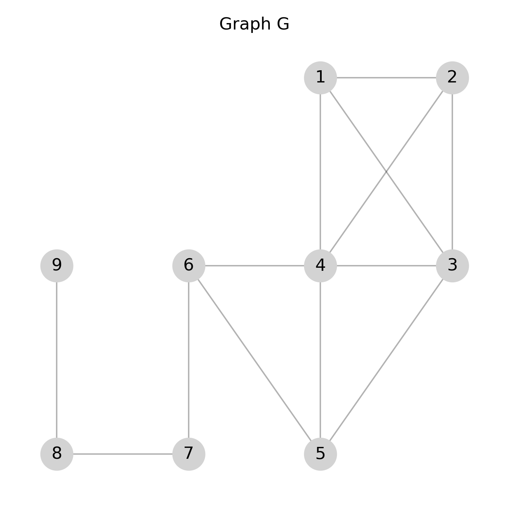

<!--
SPDX-FileCopyrightText: 2025 Daniela Scherer dos Santos <dssantos@dei.uc.pt>

SPDX-License-Identifier: CC-BY-4.0 
-->


# Multiobjective Quasi-clique Problem

Daniela Scherer dos Santos and Luís Paquete, University of Coimbra, CISUC/LASI, DEI, Coimbra, Portugal  

Copyright 2025 Daniela Scherer dos Santos and Luís Paquete

This document is licensed under CC-BY-4.0.


## Introduction

<!--Given a graph $G$, the **Multiobjective Quasi-clique (MOQC)** problem [1] consists of finding a quasi-clique that simultaneously maximizes the number of vertices and its density.
In the literature, a quasi-clique is defined as any subgraph of $G$ with a density greater than or equal to a specified threshold $\gamma$ [2].
However, in MOQC no threshold is specified in advance.
The density becomes one of the objectives to optimize, together with the number of vertices.

This formulation addresses limitations inherent to the single-objective counterpart of MOQC, specifically the Densest k-subgraph (DKS) [3] and the Maximum quasi-clique (MQC) [1] problems.
Unlike DKS, which seeks a subgraph of fixed size $k$ with maximum density, and MQC, which aims to find a quasi-clique of maximum size with a density greater than or equal to a given threshold $\gamma$, MOQC eliminates the need for predefined preference information regarding the number of vertices or density.-->
Given a graph $G$, a quasi-clique is defined as any subgraph of $G$ with a density greater than or equal to a specified threshold $\gamma$ [1].
Two combinatorial optimization problems can be defined for quasi-cliques: ($i$) the Densest k-subgraph (DKS) [2], which asks for a subgraph of fixed number of vertices $k$ with maximum density, and ($ii$) the Maximum Quasi-clique (MQC) [1] problem, which aims to find a quasi-clique of maximum number of vertices and density greater than or equal to a given threshold $\gamma$.

Both DKS and MQC require specifying in advance the desired number of vertices ($k$) and the minimum density threshold ($\gamma$), respectively. However, in many practical applications, providing this information with a high degree of precision can be challenging and limiting.

The **Multiobjective Quasi-clique (MOQC)** [3] problem was proposed to overcome this limitation. 
Its goal is to identify the set of efficient quasi-cliques. A quasi-clique is considered efficient if there is no other feasible quasi-clique with at least as many vertices and at most the same density, with at least one of these inequalities being strict.

The problem is NP-hard [3] with many relevant applications fields such as social networks, telecommunications, and bioinformatics.

## Task

Given a graph, the goal is to identify a set of feasible quasi-cliques that approximates the set of efficient quasi-cliques as closely as possible. 

## Detailed description

Consider an undirected and simple graph $G = (V,E)$, where 
$V$ and $E$ are the vertex and edge sets of $G$, respectively. 
For a set of vertices $S \subseteq V$, we denote by $G_S=(S,E(S))$ the subgraph (quasi-clique) induced by $S$ in $G$.
The density of $G_S$, denoted by $dens(G_S)$, is the ratio between the number of edges in $G_S$ and the number of edges in a complete graph with 
$|S|$ vertices, that is, 

$$
dens(G_S) = \frac{2 \cdot |E(S)|}{|S| \cdot (|S|-1)}
$$


Given $G$, 
the MOQC problem asks for a quasi-clique $G_S$ induced by $S \subseteq V$ such that   

$$S \in \underset{S^\prime \subseteq V}{\operatorname{argmax}} \lbrace \left(dens(G_{S^\prime}),  |S^\prime| \right) \rbrace$$

Note that $G$ can be unconnected.


## Instance data file

Each instance file represents an **undirected simple graph** in a format commonly used for real-life graphs (e.g. Matrix Market '.mtx' files). Its structure is as follows:

#### Comments
- Lines starting with '%' are **comments**.
- They often contain metadata, descriptions, or source information about the graph.
- These lines should be ignored when reading the graph.

#### Header

The first non-comment line contains two integers:
- **First number:** Total number of vertices in the graph.
- **Second number:** Total number of edges in the graph. 

#### Edges
Each of the following lines represents an edge between two vertices. For example `1 2` indicates an edge between vertex 1 and vertex 2. Vertices are numbered consecutively from 1 to $|V|$.

## Solution file

The solution file describes the quasi-clique identified by the applied approach to solve the MOQC problem. Its format is as follows:

- **First line:** An integer representing the number of vertices in the quasi-clique. 
- **Second line:** An integer representing the number of edges in the quasi-clique.
- **Third line:** A real number representing the quasi-clique density.
- **Fourth line:** A list of vertex identifiers (integers) that belong to the quasi-clique. Each vertex should appear exactly once.

In case the approach for solving the problem returns a set of solutions, each solution should be reported in a single file.

## Example

### Instance

```
%%MatrixMarket matrix example
9 13
1 2
1 3
1 4
2 3
2 4
3 4
3 5
4 5
4 6
5 6
6 7
7 8
8 9
```
### Solution

```
5
7
0.70
1 2 3 4 6
```

### Explanation

The following figures illustrate the MOQC problem for the example instance previously mentioned.

#### Original Graph G

This figure shows all vertices and edges in the input graph.



#### Feasible Solution

In the following figure, the quasi-clique induced by the green vertices corresponds to the **feasible solution** provided in the example. It contains 5 vertices, 7 edges, and $dens=0.70$.


Notice that the MOQC problem does not impose any constraint on the connectedness of the solution quasi-clique. Therefore, a feasible quasi-clique can also be **unconnected**. 
The following figure shows such an example for the same input instance. It contains 5 vertices, 6 edges, and $dens=0.60$.


    
## Acknowledgements

This problem statement is based upon work from COST Action Randomised
Optimisation Algorithms Research Network (ROAR-NET), CA22137, is supported by
COST (European Cooperation in Science and Technology).


## References
[1] Abello, J., Pardalos, P.M., Resende, M.G.C., 1999. On Maximum Clique Problems in Very Large Graphs. American
Mathematical Society, USA. p. 119–130.   

[2] Corneil, D.G., Perl, Y., 1984. Clustering and domination in perfect graphs. *Discrete Applied Mathematics* 9, 27–39. [https://doi.org/10.1016/0166-218X(84)90088-X](https://doi.org/10.1016/0166-218X(84)90088-X) 

[3] Daniela Scherer dos Santos, Kathrin Klamroth, Pedro Martins, and Luís Paquete.
2024. Solving the Multiobjective Quasi-clique Problem. European Journal of
Operational Research (2024). [https://doi.org/10.1016/j.ejor.2024.12.018](https://doi.org/10.1016/j.ejor.2024.12.018) 

