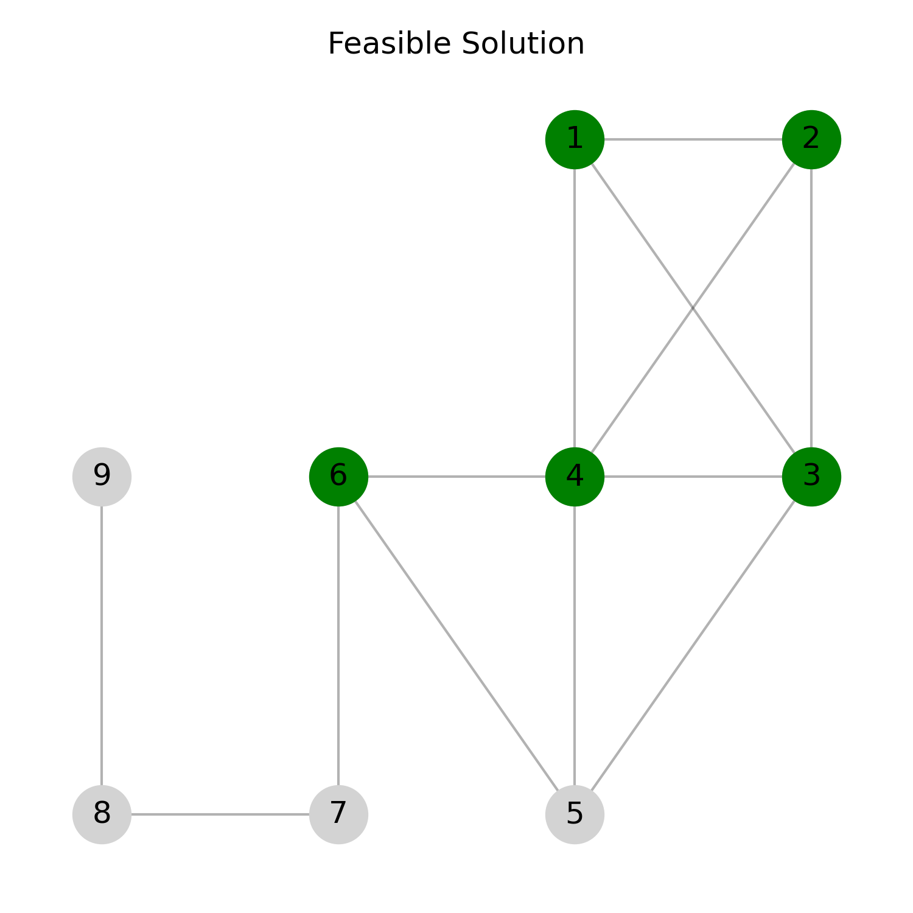
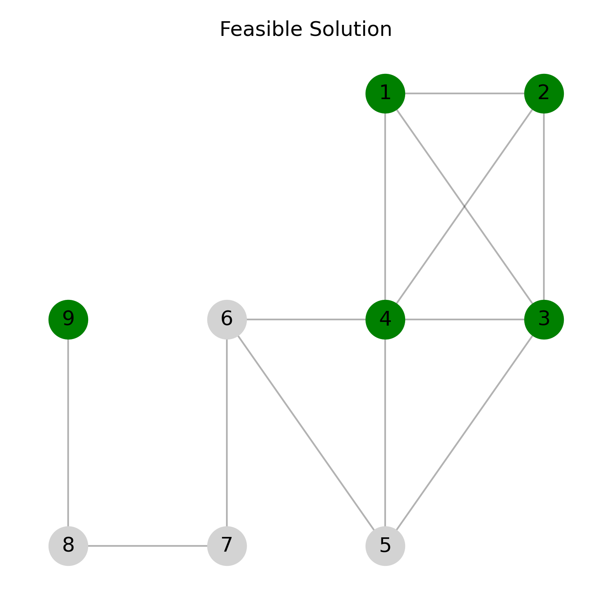
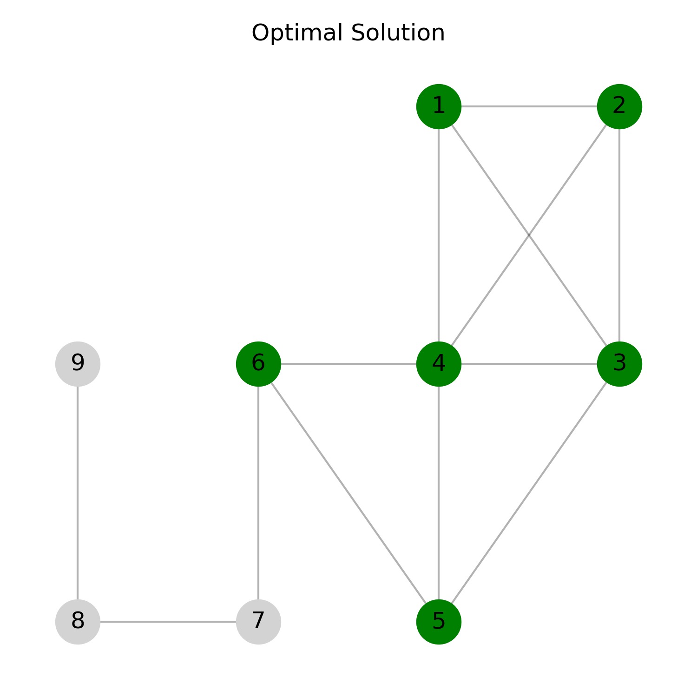

<!--
SPDX-FileCopyrightText: 2025 Daniela Scherer dos Santos <dssantos@dei.uc.pt>

SPDX-License-Identifier: CC-BY-4.0 
-->

<!-- markdownlint-disable MD033 -->

# Maximum Quasi-clique Problem

Daniela Scherer dos Santos and Luís Paquete, University of Coimbra, CISUC/LASI, DEI, Coimbra, Portugal  

Copyright 2025 Daniela Scherer dos Santos and Luís Paquete

This document is licensed under CC-BY-4.0.

## Introduction

A quasi-clique is a subgraph whose density is at least $\gamma$ $(0 < \gamma \leq 1)$. The Maximum Quasi-clique (MQC) problem [1] is a combinatorial problem that consists of finding a quasi-clique of maximum number of vertices.

The problem is NP-hard [2][3] and finds applications in many real-world domains, such as social networks, telecommunications, and bioinformatics.

## Task

Given a graph and a threshold $\gamma$, the goal is to identify a quasi-clique with the maximum number of vertices.

## Detailed description

Consider an undirected and simple graph $G = (V,E)$, where $V$ and $E$ are the vertex and edge sets of $G$, respectively. For a set of vertices $S \subseteq V$, we denote by $G_S=(S,E(S))$ the subgraph induced by $S$ in $G$.
The density of $G_S$, denoted by $dens(G_S)$, is the ratio between the number of edges in $G_S$ and the number of edges in a complete graph with $|S|$ vertices, that is,

$$
dens(G_S) = \frac{2 \cdot |E(S)|}{|S| \cdot (|S|-1)}
$$

Given $G$ and a positive real number $\gamma$, with  $0 < \gamma \leq 1$, the MQC problem consists of finding a subgraph $G_S$ induced by $S \subseteq V$ such that

$$|S|=\max \lbrace|S^\prime| : S^\prime \subseteq V, dens(G_{S^{\prime}}) \geq \gamma\rbrace$$

Note that $G$ can be unconnected.

## Instance data file

Each instance file represents an **undirected simple graph** in a format commonly used for real-life graphs (e.g. Matrix Market '.mtx' files) and also specifies the value of $\gamma$. Its structure is as follows:

### Comments

- Lines starting with '%' are **comments**.
- They often contain metadata, descriptions, or source information about the graph.
- These lines should be ignored when reading the graph.

### Header

The first non-comment line contains three values:

- **First number:** The threshold $\gamma$, a real number with two decimal places.
- **Second number:** Total number of vertices in the graph.
- **Third number:** Total number of edges in the graph.

### Edges

Each of the following lines represents an edge between two vertices. For example `1 2` indicates an edge between vertex 1 and vertex 2. Vertices are numbered consecutively from 1 to $|V|$.

## Solution file

The solution file describes the quasi-clique identified by the applied approach to solve the MQC problem. Its format is as follows:

- **First line:** An integer representing the number of vertices in the quasi-clique. This corresponds to the evaluation measure for the MQC problem.
- **Second line:** An integer representing the number of edges in the quasi-clique.
- **Third line:** A real number representing the quasi-clique density, which must be greater than or equal to the specified value of $\gamma$.
- **Fourth line:** A list of vertex identifiers (integers) that belong to the quasi-clique. Each vertex should appear exactly once.

## Example

### Instance

```text
%%MatrixMarket matrix example
0.60 9 13
1 2
1 3
1 4
2 3
2 4
3 4
3 5
4 5
4 6
5 6
6 7
7 8
8 9
```

### Solution

```text
5
7
0.70
1 2 3 4 6
```

### Explanation

The following figures illustrate the MQC problem for the example instance previously mentioned.

#### Original Graph G

This figure shows all vertices and edges in the input graph.


#### Feasible Solution

In the following figure, the quasi-clique induced by the green vertices corresponds to the **feasible solution** provided in the example for $\gamma=0.60$. It contains 5 vertices, 7 edges, and $dens=0.70$.



Notice that the MQC problem does not impose any constraint on the connectedness of the solution quasi-clique. Therefore, a feasible quasi-clique can also be **unconnected**.
The following figure shows such an example for the same input instance. It contains 5 vertices, 6 edges, and $dens=0.60$.



#### Optimal Solution

In addition, the next figure illustrates an **optimal solution** for the input instance, showing a quasi-clique with the maximum number of vertices for $\gamma=0.60$. It contains 6 vertices, 10 edges, and $dens=0.67$.



## Acknowledgements

This problem statement is based upon work from COST Action Randomised
Optimisation Algorithms Research Network (ROAR-NET), CA22137, is supported by
COST (European Cooperation in Science and Technology).

## References

[1] Abello, J., Pardalos, P.M., Resende, M.G.C., 1999. On Maximum Clique Problems in Very Large Graphs. American
Mathematical Society, USA. p. 119–130.

[2] Asahiro, Y., Iwama, K., 1995. Finding dense subgraphs, in: Staples, J., Eades, P., Katoh, N., Moffat, A. (Eds.), Algorithms and Computations, Springer Berlin Heidelberg, Berlin, Heidelberg. pp. 102–111. [https://doi.org/10.1007/BFb0015413](https://doi.org/10.1007/BFb0015413).

[3] Pattillo, J., Veremyev, A., Butenko, S., Boginski, V., 2013. On the maximum quasi-clique problem. Discrete Applied
Mathematics 161, 244–257. [https://doi.org/10.1016/j.dam.2012.07.019](https://doi.org/10.1016/j.dam.2012.07.019).
