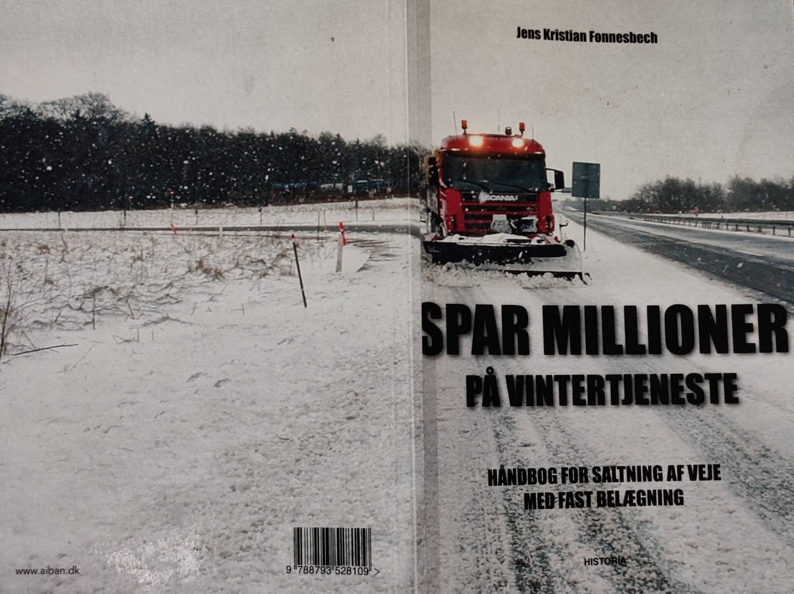
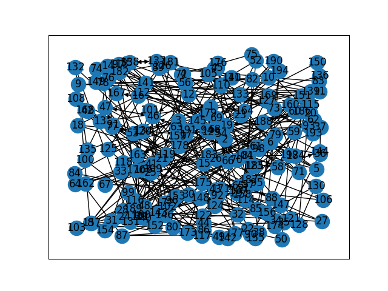
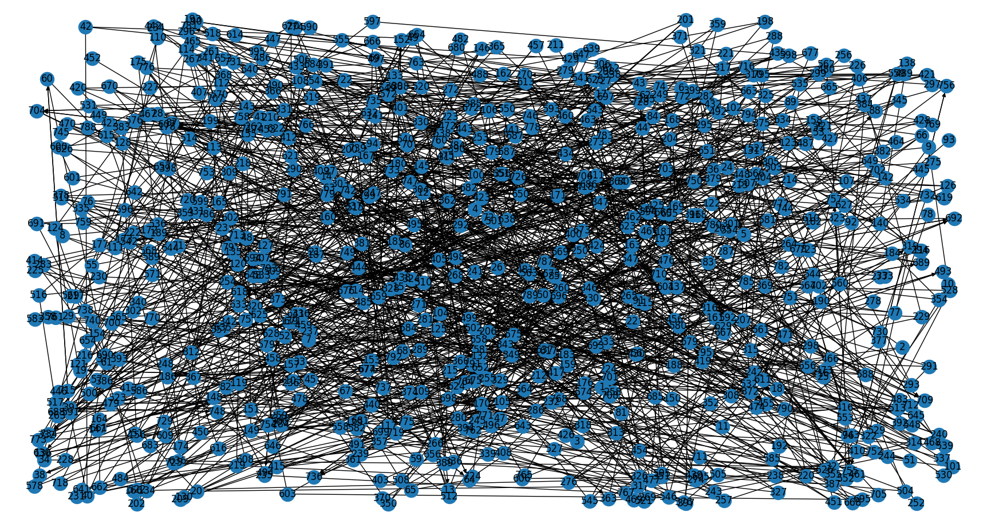
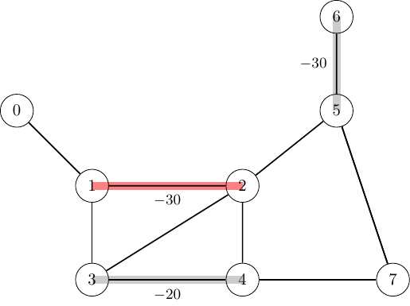

<!--
SPDX-FileCopyrightText: 2024 Marco Chiarandini <marco@imada.sdu.dk>

SPDX-License-Identifier: CC-BY-SA-4.0
-->

<!-- Replace the comment above with your licence information for your problem
statement. Consider all copyright holders and contributors. -->

<!-- According to the copyright and licensing policy of ROAR-NET original
problem statements contributed to this repository shall be licensed under the
CC-BY-4.0 licence. In some cases CC-BY-SA-4.0 might be accepted, e.g., if the
problem is based upon an existing problem licensed under those terms. Please
provide a clear justification when opening the pull request if the problem is
not licensed under CC-BY-4.0 -->

<!-- Remove the section below before submitting 

# Problem template

This folder provides a template for problem statements.

Replace the problem statement below according to the instructions within that
file (and remove this section).

Place any images and figures in the `images` folder.

Place instance data in the `data` folder. The organisation within that folder is
merely a suggestion and may be adapted according to the problem needs.

Place any support material (e.g., instance generators, solution evaluators,
solution visualisers) in the `support` folder.

Template follows below.

---
-->

<!-- Remove the section above before submitting -->

# Salt Spreading

Marco Chiarandini, University of Southern Denmark, Denmark

<!-- Put two empty spaces at the end of each author line except the last for
proper formatting -->

Copyright 2024 Marco Chiarandini

This document is licensed under CC-BY-SA-4.0.

<!-- Complete the above accordingly. Copyright and licensing information must be
consistent with the comment at the beggining of the markdown file -->

## Introduction

<!--
In this section provide a brief introduction of the problem, possibly including
its motivation and context. This should be a short (2 or 3 paragraphs)
high-level description.
-->

In the winter season, when forecasts announce temperatures below the freezing
point, municipalities are faced with the task of spreading salt in their road
networks.

The problem described here was presented by Jens Kristian Fonnesbach owner of
the company [Aiban](https://aiban.dk/) and author of the book "[Spar Millioner
paa
Vintertjeneste](https://historia.dk/shop/13-business/90-fonnesbech-spar-millioner-paa-vintertjeneste-2017/)",
2017, Historia.  The data we will describe relate to salt spreading task for
which Aiban was contracted by local authorities of the Danish municipalities of
Kerteminde and Middelfart.

## Task

<!--
Describe the high-level optimisation task in one or two sentences.
-->

Given a road network made of roads that need to be salted, roads that can be
transited and directions of transit, given a fleet of salt vehicles with a salt
capacity and refilling depots, we want to find the set of routes that satisfy
salting requirements and minimizes to the total traveled distance.  Minimizing
the traveled distance is correlated with accomplishing the salting task with the
least fuel consumption and thus minimal environmental impact (CO2 imprint). In
order to be usable in practice the routes must take into account the capacity of
the vehicle. If the salt load is not enough the vehicle must visit a refill
depot.  Further, there might be constraints on the shape of the routes to allow
easy movements of the vheicles. For example, U-turns in some parts of the
networks are not allowed.

## Detailed description

<!--
Provide a detailed description of the problem in this section. This should
detail what parameters characterise a problem instance, what characterises a
solution, how a solution is evaluated (e.g. an objective function), and solution
feasibility constraints.
-->

We are given a network of roads that can be traversed, among which some roads
must be salted. A number of vehicles depart from their respective dwelling place
nodes and have to salt the roads requesting it. The load of salt that the
vehicles can carry is in general insufficient to cover all roads, therefore
routes might include reloading at opportune depots. After having salted the last
requested road, the vehicles always visit a depot where they are reloaded with
fuell and salt before heading to a dwelling place, ready for the next time. It
is assumed that the vehicles are "off duty" after the final reload, hence the
path from the refilling depot to their dwelling place does not count in the time
duration and in the travling distance calculation.  Further, due to the size of
the vehicles and the movements they have to make, U-turns at some intersections
are not allowed.

<!--
The problem is a generalization of the Capacited Arcs Routing
Problem~\cite{Arc9} with the additional constraints of reloading and
U-turn avoidance.
-->

In the following we specify the problem more formally.

We represent the road network by a _mixed graph_ ${G}=(V, E \cup {A})$.  The set
of nodes $V$ includes the set of road intersections, the set of refilling
depots, $D$, and the set of dwelling places to the vehicles, $H$.  The set $E$
is the set of edges that can be traversed in both directions and it includes the
set $E_R$ of edges that must be salted (it is sufficient to salt them in only
one direction). The set of arcs $A$ represents links that can be traversed only
in one direction and it includes the set $A_R$ of arcs required to be salted.

We call _trip_ the sequence of edges and arcs visited by a vehicle that departs
from a dwelling place or from a depot and arrives at a dwelling place or at a
depot. A _route_ is a sequence of trips that departs from a dwelling place and
arrives at a dwelling place.

We denote by $Z$, indexed by $z$, the set of vehicles, by $K$, indexed by $k$,
the set of all trips and by $K_z \subseteq K$ the set of trips composing the
route of the vehicle $z \in Z$.  Each vehicle $z$ has a single dwelling location
$h_z$ from $H$ from which it departs and returns.

The task is finding a set of routes such that:

- edges in $E_R$ and arcs in $A_R$ are salted by at least one vehicle's route;
- the difference between the departure and the arrival time of each route is not
  greater than a given time limit $T$;
- at any point in the route the residual capacity of the vehicle is non-negative;
- there are no U-turns at nodes where they are not allowed;

and such that it minimizes the total length.

## Instance data file

Describe the format of a problem instance file.

We provide two real-life instances and two examples. The real-life instances are
provided by the company Aiban and relate to the two Danish municipalities of
Kerteminde and Middelfart. We make available the original spreadsheet as well as the
post processed json format.

### Real-Life instances

### The Spreadsheets

Each node (column `Knude punkt`) represents a road intersection and at each
node it is given a set of edges (roads) departing from that node (the adjacency
list representation of $G$). The
column `status` indicates whether an edge needs to be salted and in
which direction. A status of 1 indicates that the corresponding edge needs to be
salted but the direction is free. A status of 2 indicates that the edge
must be salted in a predefined direction. A status of 3 indicates that
the edge does not need to be salted. We assume that all edges listed can
be traversed in both directions.
<!-- {\mc{I need to ask to the company if this is true.} -->

Each edge has a column indicating the length of the road (`længde`) and a column
indicating the breadth of the road (`salt m`), both represented in meters and
calculated with one decimal.  The vehicles are identical. They have a salt
capacity of $12.3 \mathrm{m}^3$ and they spread $30\textrm{ml}$ of salt per
$\mathrm{m}^2$ of road. Since, $1\textrm{ml} = 1
\mathrm{cm}^3=10^{-6}\mathrm{m^3}$, on each road segment of length $\ell$ and
width $w$ (expressed in $\mathrm{m}$ they use $30\cdot 10^{-6} \cdot \ell \cdot
w\mathrm{m}^3$ of salt). The depots are in node 1 and in node 179 and the two
drivers start and end at their dwelling places at node 2 and 130, respectively.
The vehicles have speed 65 km/h both when salting and when deadheading. The
salting of the roads has to be completed within 3.5 hours and the overall
objective is to minimise the total traveled distance. 

<!-- The drivers visit a depot before returning to their dwelling place with their
vehicles, therefore they start with a full cargo hold of salt and fuel
tanks. The path from the depot to dwelling place does not count in the traveling
time and distance. -->

Statistics:

- $|V|$=193, $|A|$=10 $|A_R|$=33, $|E_R|$= 233
- 265.602 total sum of lengths of the arcs and edges to salt
- 21.450 total sum of lengths of the deadhead arcs available
- 1.018.806 total required demand
- 820.000 total capacity

The data in the spreadsheet does not include the coordinates of the road
intersections, thus the precise map reconstruction is not possible. For the
Kerteminde instance we have available a series of [maps](data/kerteminde/maps) that
indicate the position of the points. However, in the `.json` format that we
provide the coordinates are an approximate reconstruction achieved with
multidimensional scaling on the basis of the road lengths. Those coordinates
have no geographical correspondence. They give rise to the following plot:

### Middelfart

The instance bears the same characteristics as the Kerteminde instance. 

Statistics:

- $|V|$=784, $|A|$=56 $|A_R|$=62, $|E_R|$= 1004
- 40.280 total sum of lengths of the deadhead arcs available
- 544.198 total sum of lengths of the arcs and edges to salt
- 1.929.260 total required demand
- 1.230.000 total capacity

### The `.json` format

## Solution file

Describe the format of a solution file.

## Example

### Instance

<!-- Provide a small example instance in the described format. -->

The Data are . It is in the form of a
spread sheet as seen in Figure~\ref{data}.

<!--
{ width="515" height="385" style="display:
block; margin: 0 auto; text-align: center" }
-->

### Solution

Provide a feasible solution to the example instance in the described format
(including its evaluation measure).

### Explanation

Optionally, provide a descriptive and/or visual explanation of the solution (and
its evaluation measure value) for the instance.

## Acknowledgements

This problem statement is based upon work from COST Action Randomised
Optimisation Algorithms Research Network (ROAR-NET), CA22137, is supported by
COST (European Cooperation in Science and Technology).

<!-- Please keep the above acknowledgement. Add any other acknowledgements as
relevant. -->

## References

Put any relevant references here.
