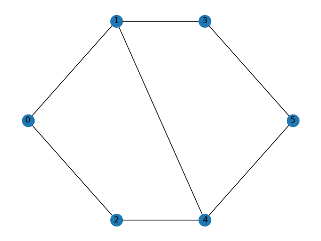

<!--
SPDX-FileCopyrightText: 2024 Noé Godinho <noe@dei.uc.pt>

SPDX-License-Identifier: CC-BY-4.0
-->

# Service Placement Problem

Noé Godinho, University of Coimbra, Centre for Informatics and Systems of the University of Coimbra, Department of Informatics Engineering.

Copyright 2024 Noé Godinho.

This document is licensed under CC-BY-4.0.

## Introduction

One of the main problems in communications is the routing problem, where the goal is to find a path between two devices that minimises a given metric. Usually, that metric is latency or number of hops. However, that problem is too restrictive, due to bandwidth or device usage not being taken into account when solving the problem.

The service placement problem was proposed to tackle these issues. The goal is to optimise a set of requests in a network, where each request is composed by source and destination, bandwidth requirements and a set of services to offload, with CPU and RAM requirements. This problem is NP-complete, making it hard to solve in realistic scenarios. Thus, efficient techniques to obtain (near-)optimal solutions are necessary. 

## Task

Given a graph, a set of requests and their services to be offloaded, minimise the overall latency and processing time of all requests and services, taking resource constraints into account.

## Detailed description

Given $N$ nodes, $E$ edges, $R$ requests and $S_r$ services for each request $r$, the following objective function aims to minimise latency and processing time:

$$\min \sum_{r \in R} \left(\sum_{(u,v) \in E} x_{uvr}l_{uv} + \sum_{i \in N} \sum_{s \in S_r} y_{irs}p_i \right)$$

where $x_{er}$ is a 1 if request $r$ traverses edge $e$, 0 otherwise. $y_{irs}$ is 1 if service $s$ from request $r$ is offloaded to node $i$, 0 otherwise. $l_e$ and $p_i$ are the latency of edge $e$ and processing time of node $i$, respectively.

The first constraints aim to ensure that the offloaded services do not exceed the total CPU and RAM. The equations are as follows:

$$\sum_{r \in R} \sum_{s \in S_r} y_{irs} cpu_{rs} \leq C_i, ~~~~~\forall i \in N$$
$$\sum_{r \in R} \sum_{s \in S_r} y_{irs} ram_{rs} \leq M_i, ~~\forall i \in N$$

where $cpu_{rs}$ and $ram_{rs}$ correspond to the requested CPU and RAM, respectively. $C_i$ and $M_i$ correspond to the total CPU and RAM of each node.

It is also necessary to ensure that the total bandwidth of each link is not exceeded. The constraint is as follows:

$$\sum_{r \in R} x_{uvr} b_{uv} \leq BW_i, ~~\forall (u,v) \in E$$

where $b_e$ corresponds to the requested bandwidth and $BW_i$ corresponds to the total bandwidth of an edge.

Finally, it is necessary to ensure that a path exists. The equation is as follows:

$\sum_{j \in N} x_{ijr} - \sum_{j \in N} x_{jir} = U_{ir}, ~~\forall i \in N, r \in R$

where $U_{ir}$ is 1 if node $i$ corresponds to a source node, -1 if $i$ corresponds to a target node and 0 otherwise.

## Instance data file

Each instance file contains a graph, the requests, and their services requirements.

The first line contains **N** number of nodes.
Each node contains its number, the total CPU (in MIPS), the total RAM (in Mb), the energy consumption of the processing (in Watt), and the processing time (in s).

After the nodes, the first line contains **E** number of edges.
Each edge contains the connected nodes, the bandwidth (in Mbps), the energy consumption of the communication (in Watt), and the latency (in s).

Then, the requests start.
The first line contains **R** number of requests.
Each request contains the source node, the destination node, and the requested bandwidth.

Afterwards, the services for each request are described.
The first line contains **S$_r$** number of services for each given request.
Each service contains the requested CPU (in MIPS) and RAM (in Mb).

Constraints:
**N** $\geq 2$
**E** $\geq$**N**$-1$
**R** $\geq 1$
**S$_r$** $\geq 1$

## Solution file

The solution file starts with the path for the first request, followed by the node where each service of the request is placed.

The number of requests and services for each request in the solution file must match the values of the instance file, as well as the source and destination nodes for each request.

## Example

### Instance

6
0,1000,512,0.1
1,1000,512,0.1
2,1000,512,0.1
3,1000,512,0.1
4,1000,512,0.1
5,1000,512,0.1
7
0,1,1000,0.1
0,2,1000,0.2
1,3,100,0.1
1,4,1000,0.2
2,4,1000,0.2
3,5,1000,0.1
4,5,1000,0.2
2
0,5,500
1
100,100
0,5,100
2
100,100
100,100

### Solution

0,1,4,5
0
0,1,3,5
0
0

Evaluation: 1.1s

### Explanation

The presented graph contains 6 nodes, each with a total of 1000 MIPS, 512 Mb of RAM, and 0.1s of processing time.
7 edges are considered, with 1000 Mb of bandwidth (except edge 1-3, with 100 Mb), and 0.1s or 0.2s latency.
The following image shows the network topology of the example instance. 

This instance aims to optimise two requests. Both requests have the node 0 as the source and node 5 as the destination. 
The first requires a value of 500 Mb of bandwidth and needs to offload 1 service, which requires 100 MIPS and 100 Mb of RAM.
The second requires a value of 100 Mb of bandwidth and needs to offload 2 services, each requiring 100 MIPS and 100 Mb of RAM.

Regarding the solution, the first line contains the path 0,1,4,5 of request 1, followed by the node where the service is offloaded (0). Edge 1-3 cannot be used due to the low bandwidth.
Afterwards, the path 0,1,3,5 for request 2 is shown, followed by the nodes where both services of request 1 are offloaded (both use node 0).
Since the number of services is small and the processing time is the same for all nodes, the offloaded services can use the same node without worsening the objective function value.

To evaluate the solution, several verifications are made. Each request path and services' nodes must be valid, and the problem constraints must be ensured. If any of these verifications are not valid, $\infty$ will be returned. Otherwise, the presented value will be the sum of latency and processing time of each node/link. 

## Acknowledgements

This problem statement is based upon work from COST Action Randomised Optimisation Algorithms Research Network (ROAR-NET), CA22137, is supported by COST (European Cooperation in Science and Technology).

## References

X. Huang, S. Ganapathy, and T. Wolf, ‘Evaluating Algorithms for Composable Service Placement in Computer Networks’, in 2009 IEEE International Conference on Communications, Dresden, Germany: IEEE, Jun. 2009, pp. 1–6. doi: [10.1109/ICC.2009.5199007](https://doi.org/10.1109/ICC.2009.5199007).

N. Kumari, A. Yadav, and P. K. Jana, ‘Task offloading in fog computing: A survey of algorithms and optimization techniques’, Computer Networks, vol. 214, p. 109137, Sep. 2022, doi: 10.1016/j.comnet.2022.109137.

H. Lin, S. Zeadally, Z. Chen, H. Labiod, and L. Wang, ‘A survey on computation offloading modeling for edge computing’, Journal of Network and Computer Applications, vol. 169, p. 102781, Nov. 2020, doi: 10.1016/j.jnca.2020.102781.